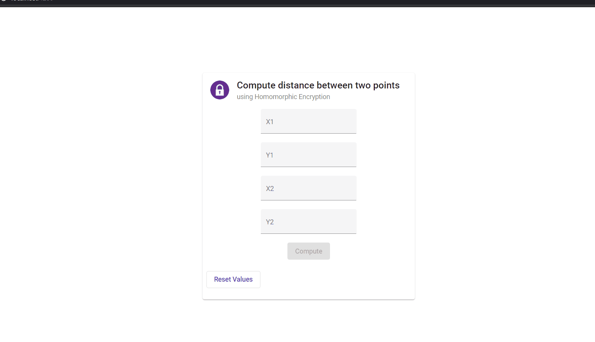
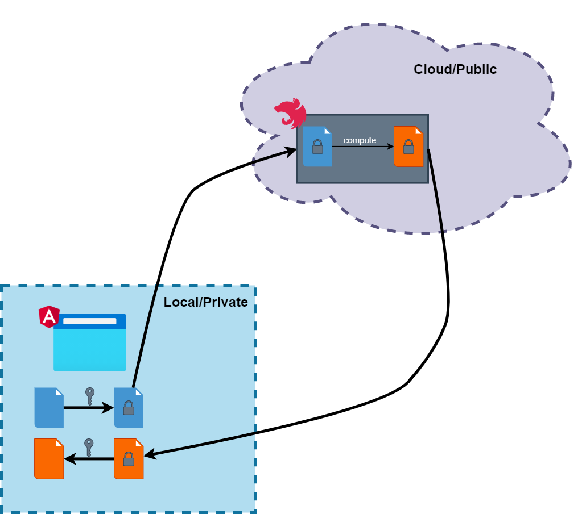

# Homomorphic two dimensional Euclidean distance computation using SEAL

## Table of contents

- [Introduction](#introduction)
- [Architecture](#architecture)
- [Technologies involved](#technologies-involved)
- [How to run it?](#how-to-run-it-)
  * [Client](#client)
  * [Server](#server)
- [Remarks](#remarks)

<small><i><a href='http://ecotrust-canada.github.io/markdown-toc/'>Table of contents generated with markdown-toc</a></i></small>

## Introduction

> *Homomorphic encryption* (`HE`) is a form of encryption that permits users to **perform computations on its encrypted data** without first decrypting it. These resulting computations are left in an encrypted form which, when decrypted, result in an identical output to that produced had the operations been performed on the unencrypted data.
Homomorphic encryption can be used for **privacy-preserving outsourced storage and computation**. ([Source](https://en.wikipedia.org/wiki/Homomorphic_encryption))

This repository contains a demo application where distance between two points is computed remotely **without revealing the actual data** to the third-parties and preserving privacy. 

## Architecture

## Technologies involved

* [Angular](https://angular.io/) - web app
* [NestJS](https://docs.nestjs.com/) - server app
* [Microsoft SEAL](https://www.microsoft.com/en-us/research/project/microsoft-seal/) - homomorphic encryption library
* [node-seal](https://github.com/morfix-io/node-seal) - SEAL WebAssembly wrapper

## How to run it?

> `node.js` is required both for client-side and server-side

### Client
1. `cd client`
2. `npm install`
3. `npm start`

### Server
1. `cd cloud`
2. `npm install`
3. `npm start`

## Remarks

* This is just a Proof-of-Concept in order to test how homomorphic encryption can be used in web applications
* The square root operator that is used in the Euclidean distance formula is computed on the client-side using `Math.sqrt(..)` due library limitations
* HE seems to be good candidate for future for applications that are doing compute-intensive operations on private data